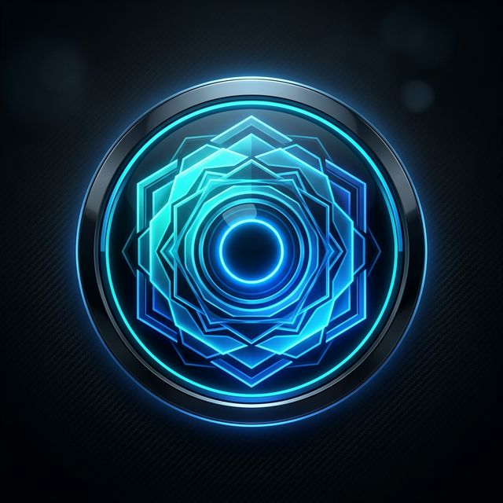

<p align="center">
  
</p>

<h1 align="center">AgentLens</h1>
<p align="center">
  <strong>Discover, Compare & Generate Production-Grade AI Agent Architectures</strong>
</p>

<p align="center">
  <a href="https://agentlens.app">Live Demo</a> ·
  <a href="#features">Features</a> ·
  <a href="#getting-started">Get Started</a> ·
  <a href="https://www.linkedin.com/in/saikumarvutti/">Connect</a>
</p>

<p align="center">
  
  
  
  
</p>

---

## What is AgentLens?

**AgentLens** is an intelligent AI agent stack advisor that helps developers and engineering teams **discover, compare, and design** production-grade multi-agent architectures in seconds.

💡 **Describe your requirements** → Get a complete workflow architecture diagram with real tools, cost estimates, and a development roadmap — powered by AI.

---

## Features

### ⚡ AI-Powered Workflow Generator
Describe your project in plain English and get a **dynamically generated**, production-grade architecture with 7–15 nodes, real library names, cost breakdowns, and development phases.

### 🤖 7+ AI Provider Support
Bring your own API key from **any** major provider:

| Provider | Model | Type |
|----------|-------|------|
| **Groq** | Llama 3.3 70B | Free tier (14K req/day) |
| **OpenRouter** | Nemotron 120B | Free models available |
| **Google Gemini** | Gemini 2.0 Flash | Free tier available |
| **OpenAI** | GPT-4o | Paid |
| **Anthropic** | Claude 3.5 Sonnet | Paid |
| **DeepSeek** | DeepSeek Chat | Affordable |
| **xAI** | Grok | Paid |

### 🔍 Smart Framework Analyzer
Answer 6 quick questions and get personalized recommendations across **8 frameworks**:
- LangGraph · CrewAI · AutoGen · OpenAI Swarm · Semantic Kernel · Haystack · Superagent · Custom

### 📊 Real-Time Cost Calculator
Interactive cost estimation across **9 LLM models** with configurable requests/day, tokens/request, and infrastructure costs.

### ⚖️ Framework Comparison
Side-by-side comparison matrix covering performance, scalability, learning curve, community support, and enterprise readiness.

### 🏆 Benchmark Dashboard
Visual performance benchmarks for latency, throughput, memory, and reliability across all supported frameworks.

### 💻 Code Playground
Ready-to-use starter code for each framework — copy and start building immediately.

---

## Getting Started

### Prerequisites
- **Node.js** 18+ and **npm** 9+

### Installation

```bash
# Clone the repository
git clone https://github.com/Vuttisai/AgentLense.git
cd AgentLense

# Install dependencies
npm install

# (Optional) Set up environment variables for built-in free tier
cp .env.example .env
# Edit .env and add your API keys

# Start development server
npm run dev
```

Open [http://localhost:5173](http://localhost:5173) in your browser.

### Build for Production

```bash
npm run build
npm run preview
```

---

## Configuration

### Environment Variables (Optional)

Create a `.env` file from `.env.example`:

```env
VITE_GEMINI_API_KEY=your_gemini_key
VITE_OPENROUTER_API_KEY=your_openrouter_key
VITE_GROQ_API_KEY=your_groq_key
```

> **Note:** Environment keys provide a built-in free tier. Users can also add their own API keys directly in the UI for unlimited usage.

### API Key Management
- Keys are stored in the browser's `localStorage` — never sent to any backend
- Each provider's key is stored independently
- Users can switch providers and manage keys from the UI

---

## Tech Stack

| Layer | Technology |
|-------|-----------|
| **Frontend** | React 19, Vite 8 |
| **Styling** | Vanilla CSS with CSS Variables |
| **AI Integration** | Multi-provider REST APIs |
| **3D/Animations** | CSS-only (GPU-optimized) |
| **SEO** | JSON-LD, Open Graph, sitemap |
| **Deployment** | Netlify / Vercel / Cloudflare Pages |

---

## Project Structure

```
AgentLens/
├── public/                 # Static assets, favicon, OG image, sitemap
├── src/
│   ├── components/         # Navbar, Footer, LoadingScreen, Scene3D
│   ├── sections/           # Hero, Analyzer, Results, Benchmarks, etc.
│   ├── data/
│   │   ├── frameworks.js   # Framework configs, LLM pricing data
│   │   ├── geminiWorkflow.js  # Multi-provider AI integration
│   │   └── workflowEngine.js  # Local fallback workflow engine
│   ├── App.jsx             # Main app layout & routing
│   ├── index.css           # Design system & global styles
│   └── main.jsx            # React entry point
├── index.html              # SEO-optimized HTML with structured data
├── .env.example            # Environment variable template
└── package.json
```

---

## Contributing

Contributions are welcome! Please:
1. Fork the repository
2. Create a feature branch (`git checkout -b feature/amazing-feature`)
3. Commit your changes (`git commit -m 'Add amazing feature'`)
4. Push to the branch (`git push origin feature/amazing-feature`)
5. Open a Pull Request

---

## License

This project is licensed under the **MIT License** — see the [LICENSE](LICENSE) file for details.

---

## Author

**Sai Kumar Vutti**
- LinkedIn: [linkedin.com/in/saikumarvutti](https://www.linkedin.com/in/saikumarvutti/)
- GitHub: [github.com/Vuttisai](https://github.com/Vuttisai)

---

<p align="center">
  <strong>⭐ If you find AgentLens useful, give us a star on GitHub!</strong>
</p>
